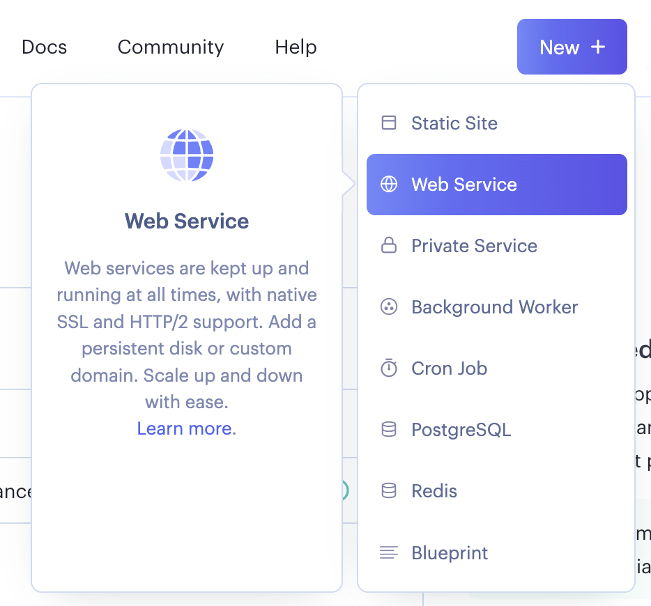
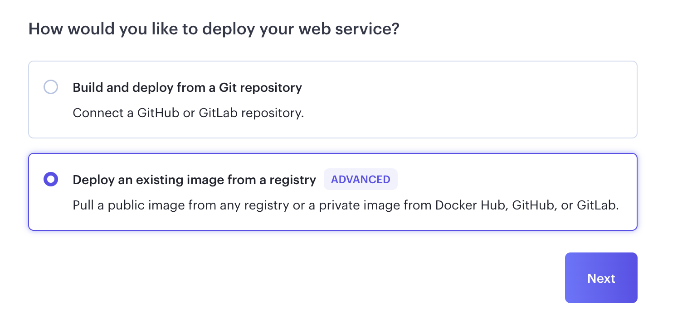
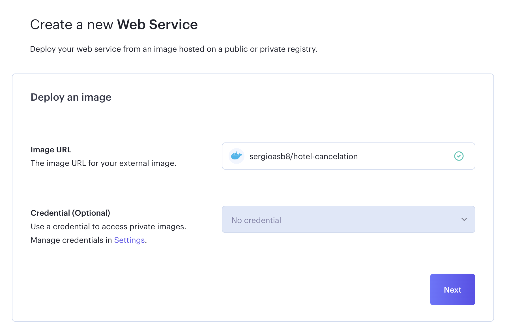
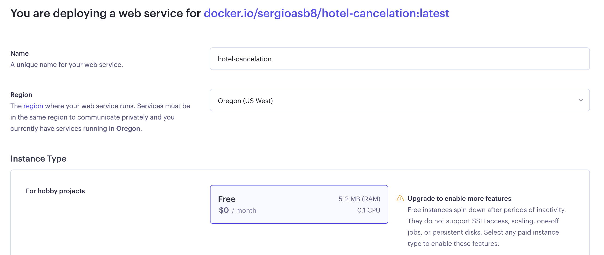
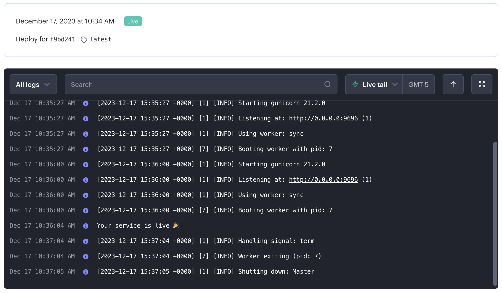

# Hotel Cancelation: Capstone 1


## Problem description

In the actual world, the velocity with which things change is incredibly fast. Having as much certainty as possible is something important when a business is trying to make a plan for the near future.

For the hotels, the cancelations made by the clients can affect their plans and especially their incomes, so the focus ins this project will be to detect whether a client will cancel the reserve or not.

## Data

To get more information about the data, refer to [Data information](https://www.kaggle.com/datasets/ahsan81/hotel-reservations-classification-dataset)


## Use the project locally on your computer

### Setup

Following the links, there is more detailed information about the required technologies where you can find information to download and how to use them.

[Python](https://www.python.org/) Python 3.11 is the recommended version.

[Docker](https://www.docker.com/)

### Clone the repository

On the cmd move to the folder where you want to save the repository and type

```bash
 git clone https://github.com/sergioasb8/hotel_cancelation_capstone1
```

### Virtual Enviroment

1. As mentioned during the setup, Make sure you have Python 3.11 installed typing in the cmd

```bash
    Python3 -V
```

2. Using the cmd or the terminal go to the project repository folder, it should appear inside the folder where you clone the repository.

3. Install the library ```pipenv```

```bash
    pip3 install pipenv
```

4. Use pipenv to install the required packages from the **Pipfile** and create the virtual environment.

```bash
    pipenv install
```

5. Activate the virtual environment.

```bash
    pipenv shell
```


### Run locally

1. Run the Flask application using gunicorn.

```bash
    gunicorn --bind 0.0.0.0:9696 predict:app
```

Once all this steps are followed correctly the Flask application will be available at ```http://0.0.0.0:9696```.

2. Use the service.

You can use the service in two different ways:
    
* With the notebook [05_test_services.ipynb](https://github.com/sergioasb8/hotel_cancelation_capstone1/blob/main/notebooks/05_test_services.ipynb) where you should run the cells under the title ***run locally***.

* Open a new cmd, move to the project folder and type 
```bash
    python3 test_local_service.py
```


## Build and run the container

### Build the Image


For this step, Docker will be creating the Image with the **Dockerfile** file.

1. Type on the terminal or cmd

```bash
    docker build -t hotel-cancelation .
```

Where ***hotel-cancelation*** will be the name of the Image and the "." will indicate to run the dockerfile that is inside the current folder.

2. Check that the Image was create. Type on the cmd

```bash
    docker images
```

this will display a list of all the images, ***hotel-cancelation*** should be in that list.

### Run locally

1. Run the Flask application using the docker image.

```bash
    docker run -it --rm -p 9696:9696 midterm-project
```

Once all this steps are followed correctly the Flask application will be available at ```http://0.0.0.0:9696```.

2. Use the service.

You can use the service in two different ways:
    
* With the notebook [05_test_services.ipynb](https://github.com/sergioasb8/hotel_cancelation_capstone1/blob/main/notebooks/05_test_services.ipynb) where you should run the cells under the title ***run locally***.

* Open a new cmd, move to the project folder and type 
```bash
    python3 test_local_service.py
```

## Deploy the cloud service


### Push the image to dockerhub and make it available online

1. Create a dockerhub account, if you have one skip this step

2. Create an access token.

* In dockerhub go to account settings

* Then security

* New Access Token, fill the Access Token description and set the permissions for the token and click in Generate.

Save the token because it will be needed for the next steps.

3. Create a repository in dockerhub, the name of the repository must be the image iname. If the image name is ***hotel-cancelation***, the repository name must be ***hotel-cancelation***.

4. Using the cmd login into the docker account, type 

```bash
    docker login
```

and then paste the ***access token***.

5. Build the docker image, type on the cmd

```bash
    docker tag hotel-cancelation:latest sergioasb8/hotel-cancelation
```

Explained it looks like this 
```bash
    docker tag [image-name]:[version] [dockerhub username]/[repository]
```

6. push the Image to dockerhub, type on the cmd

```bash
    docker push sergioasb8/hotel-cancelation
```

Explained it looks like this 
```bash
    docker push [dockerhub username]/[repository]
```

### Deploy a webservice using the Image from dockerhub

1. Create a [render account](https://render.com/) and login into the account.

2. Click in ***New*** and select the option Web service.



3. Select the option to Deploy an existing image from a registry.




4. Copy and paste the url of your docker image. It should look like this ***https://hub.docker.com/r/sergioasb8/hotel-cancelation***



Click ***Next***.

5. Select the options tha better fit your project.



Click ***Create web service***.

If everything is working correctly Render will show a view like this one




## Use the cloud service

### Setup


### Make a request to the deployed service


